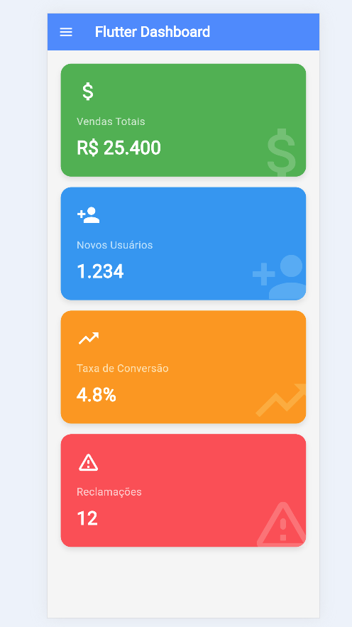
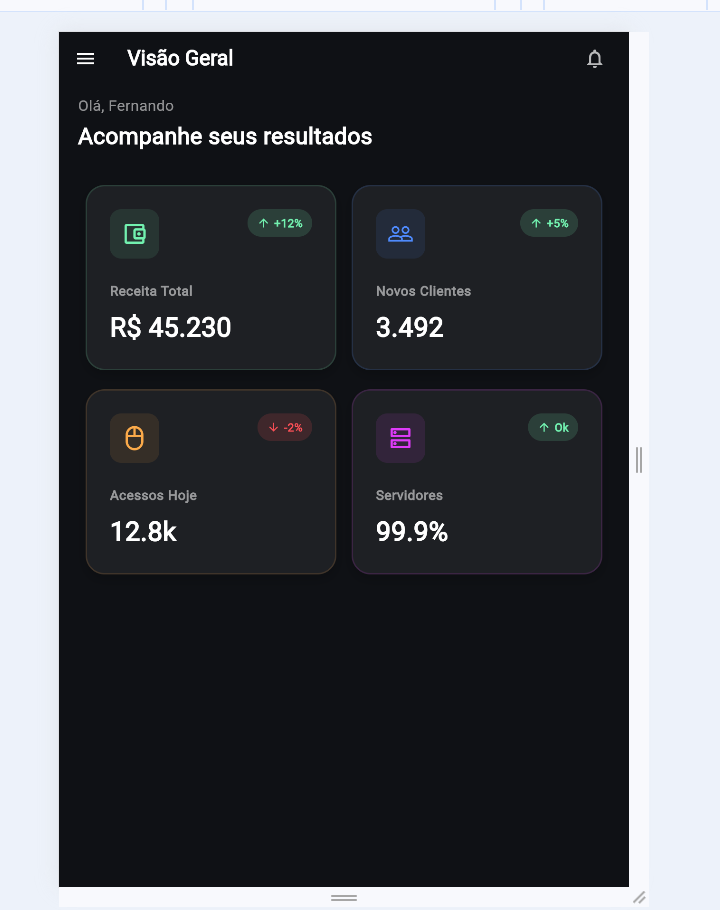
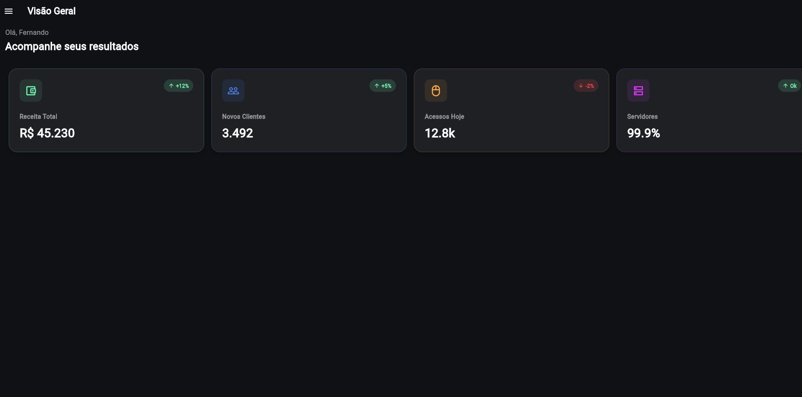

# Dashboard Responsivo em Flutter

Projeto desenvolvido como Atividade Prática (Aula 6) da disciplina de Desenvolvimento para Dispositivos Móveis do curso de Análise e Desenvolvimento de Sistemas (5ª Fase) da Faculdade Senac Joinville (2026/1).

## 👨‍🎓 Desenvolvedor
* **Nome:** Fernando Ventura
* **Turma:** Análise e Desenvolvimento de Sistemas - 5ª Fase 

## 📱 Sobre o Projeto
Este projeto consiste em um dashboard com 4 cards de informação que se adapta automaticamente a diferentes tamanhos de tela (mobile, tablet e desktop), proporcionando uma experiência otimizada em qualquer dispositivo.

### 🛠️ Conceitos e Widgets Aplicados
* **Responsividade:** Utilização do `MediaQuery` para identificar a largura da tela e definir os breakpoints.
* **Layouts Adaptativos:** Transição automática entre `Column` (Mobile), `Wrap` (Tablet) e `Row` (Desktop).
* **Distribuição de Espaço:** Uso do `Expanded` para organizar os cards simetricamente no modo desktop.
* **Componentização:** Criação de um widget reutilizável (`DashboardCard`) para exibir as métricas.
* **Bônus Implementados:** Menu de navegação lateral (`Drawer`) e uso de `Stack` com `Positioned` para criar um efeito visual de marca d'água com os ícones ao fundo de cada card.

## 📸 Screenshots dos Layouts

Abaixo estão as capturas de tela demonstrando a adaptação do layout aos 3 breakpoints suportados:

### 1. Mobile (< 600px) - Layout em Coluna (1 card por linha)


### 2. Tablet (600px a 900px) - Layout em Wrap (2 cards por linha)


### 3. Desktop (> 900px) - Layout em Row (4 cards na mesma linha)


## 🚀 Instruções de Execução

**Pré-requisitos:** Ter o Flutter SDK instalado e configurado em sua máquina.

1. Clone este repositório público:
   ```bash
   git clone 
2. cd dashboard-responsivo-fernando
3. flutter pub get
4. flutter run